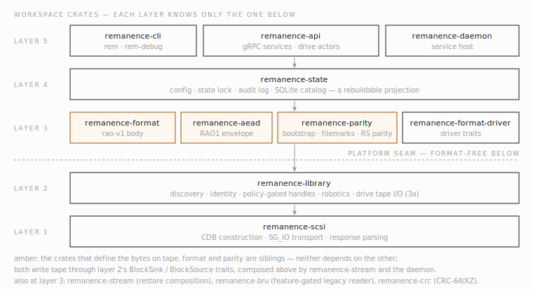

<!-- code-anchor: none -->
# Remanence

[](https://doi.org/10.5281/zenodo.21425126)

Remanence is open Rust infrastructure for writing archives to LTO tape
and getting them back decades later. It is the mechanism layer of an
archive system: a daemon and CLIs that discover tape libraries, move
cartridges, write self-describing objects with erasure-coded parity, and
account for every byte in a rebuildable catalog. What to archive, when,
and for how long are deliberately not its decisions — those belong to
whatever orchestrator calls its API.

The project exists because the long-horizon archive niche is served
mostly by proprietary systems whose on-tape formats die with their
vendors, and by tooling that treats tape like a disk. Remanence takes
the opposite bets: the format on tape is published and readable with
stock `tar`, every tape self-describes so no database is ever the single
copy of the truth, and when the hardware leaves the software uncertain
about physical state, the software stops rather than guesses. The
reasoning is laid out in [docs/why-remanence.md](docs/why-remanence.md).

It is developed against a QuadStor virtual tape library and field-tested
on an HPE MSL3040 with LTO-9 drives.

<!-- code-anchor: Cargo.toml crates proto/layer5.proto @ 8de2c46 -->
## Status

Pre-alpha, version 0.0.1. Interfaces and the gRPC contract may still
change before a stable release; the published on-tape formats (RAO 2.0,
REM-PARITY 1.0) are specified and implemented. Working today:

- Layer 1 SCSI primitives and Layer 2 library discovery, identity,
  robotics, and hot-plug watching, with per-library allowlisting.
- Layer 3 end to end: pipelined, staging-ring-backed fixed-block tape
  I/O with position proofs (this is now the only write/read path — the
  earlier non-pipelined mode and its config flag are gone), a
  watermark-gated host-RAM read reservoir with proof-frontier ranged
  reads, the `rao-v1` object format, the RAO 2.0 encrypted representation
  using the fixed `RAO1` format-family magic, and Reed-Solomon sidecar
  parity with recovery, resume, and catalog-less scan. The encrypted
  representation's fresh per-object key is wrapped to multiple recipients
  with HPKE Base mode running the X-Wing post-quantum/classical hybrid KEM
  (ML-KEM-768 combined with X25519, per
  `draft-connolly-cfrg-xwing-kem-10`) and stored in the object's own header.
- Layer 4 state: audit log, per-tape journals, and a SQLite catalog that
  is a rebuildable projection, plus media-readiness records and tape-I/O
  fences.
- Layer 5 daemon: catalog queries, pool-targeted idempotent write
  sessions, object/file/byte-range read sessions with an app-restart
  cold-resume contract (tape-identity check + device position proof),
  an advisory per-drive assignment projection for external arbitration,
  operations with cancellation, library inspection and robotics, drive
  stewardship, alarms, live status, over a Unix socket and optional
  mTLS TCP.
- Operator CLIs: `rem` and `rem-debug`, including the destructive-safety
  gauntlet for tape initialization, media-readiness quarantine tooling,
  local RAO object build/inspect/extract that needs no hardware, and a
  ranged-ciphertext `extract-stream`/`covering-range` pair for bounded,
  memory-cheap partial reads of an object already fetched locally. A
  standalone `rao-recover` binary decrypts archive objects with no
  daemon, catalog, or config file at all — the disaster-recovery path of
  last resort.
- Chaos fault-injection for tests, and Lean/Aeneas proofs over the
  parity and format cores (`verif/`).

The main gaps, from the code as it stands: authorization is a shallow
role matrix, the audit-query service is defined but not yet served,
library import/export (mailslot) handling, library-event streaming, and
write-session restart return unimplemented; batched write checkpoints are
currently parity-off only, parity
tapes do not yet support appending further objects after a committed
session, and hardware soak coverage is still growing.

<!-- code-anchor: Cargo.toml @ 2a20106 -->
## Build

Rust 1.85+, Linux. No system dependencies for the default build:

```sh
cargo build --release
```

yields `target/release/{rem,rem-debug,rem-daemon,rao-recover}`. `rem`
and `rem-debug` are two binaries built from the same crate (operator vs.
break-glass direct-hardware CLI); `rao-recover` is its own crate with no
dependency on the daemon, catalog, or config file. Optional features:
`remanence-cli/linux-udev` (hot-plug `rem watch`; needs `pkg-config` +
`libudev-dev`) and `remanence-cli/foreign-bru` (legacy BRU commands).

Tests and lints, as CI runs them:

```sh
cargo fmt --all --check
cargo clippy --workspace --exclude remanence-chaos --all-targets -- -D warnings
cargo test --workspace --exclude remanence-chaos
```

Hardware-touching tests are ignored by default and opt in via
environment variables documented in their test modules.

<!-- code-anchor: crates/remanence-cli/src/lib.rs @ 2a20106 -->
## Quickstart

The native object format works against local files, no tape required:

```sh
rem archive build --inputs some-directory --out demo.rao
rem archive inspect --object demo.rao
rem archive extract --object demo.rao --dest restored
```

`demo.rao` is a chunk-aligned POSIX pax tar stream — `bsdtar -tf
demo.rao` lists your files — and it is byte-for-byte what a tape write
stores as the object body. The full walkthrough, from local round trip
to library discovery, daemon setup, tape initialization, and a first
tape write, is [docs/guide-quickstart.md](docs/guide-quickstart.md).

## Documentation

- [Quickstart](docs/guide-quickstart.md) — runnable walkthrough.
- [Architecture overview](docs/architecture-overview.md) — the layer
  stack, write/read paths, and design invariants.
- [CLI reference](docs/reference-cli.md) — the `rem`, `rem-debug`, and
  `rem-daemon` surfaces.
- [Configuration reference](docs/reference-configuration.md) — every
  config key, default, and environment variable.
- [Tape layout reference](docs/reference-tape-layout.md) — what is
  physically on a cartridge.
- [Troubleshooting](docs/guide-troubleshooting.md) — failure modes,
  fences, and permissions.
- [Glossary](docs/reference-glossary.md) — project terms and tape
  vocabulary.
- [The formats, explained](specs/publication/formats-explained.md) —
  a plain-language companion to the specifications: the motivation and
  the design, without the normative terseness.
- Published format specifications:
  [RAO Format 2.0](specs/publication/rao-object-format-1.0.md) and
  [REM-PARITY 1.0](specs/publication/rem-parity-1.0-specification.md),
  with their pinned test-vector archive alongside.
- [proto/layer5.proto](proto/layer5.proto) — the draft gRPC contract.

<!-- code-anchor: crates/remanence-library/tests/platform_dependency_guard.rs @ 7fb10f8 -->
## Migrating foreign tapes

`crates/remanence-bru` reads tapes written by the legacy BRU backup tool.
It is auxiliary migration tooling for the narrow audience holding
BRU-written cartridges, and it is **never part of the default build or
the core binaries** — nothing links it unless you opt in with
`cargo build --features remanence-cli/foreign-bru`. Further foreign-format
readers will follow the same rule: the archival core stays lean, and
migration tooling is something you ask for.

## Platform crate contract

`remanence-scsi` and `remanence-library` are the reusable tape-platform
crates, and they are format-free: no RAO, parity, catalog, or daemon
knowledge lives below that seam. `remanence-scsi` depends on no other
Remanence crate, and `remanence-library` depends only on
`remanence-scsi`. A manifest dependency-guard test enforces the
boundary, so external tools can build their own layout and catalog on
the platform crates without pulling in the bundled formats. Portable
RAO object files follow the same discipline: they contain only the
object's stored bytes — tape filemarks, bootstrap rows, and parity
sidecars are tape-only framing.

<!-- code-anchor: Cargo.toml @ 8de2c46 -->
## Repository layout

```text
crates/remanence-scsi           Layer 1 SCSI CDB/SG_IO primitives
crates/remanence-library        Layer 2 library model/ops and Layer 3a tape I/O
crates/remanence-crc            Shared CRC-64/XZ
crates/remanence-aead           RAO 2.0 encrypted-representation primitives (fixed RAO1 family magic; X-Wing HPKE wrapped-DEK)
crates/remanence-format-driver  Published format-driver traits
crates/remanence-format         Native rao-v1 body format
crates/remanence-bru            Foreign-tape migration: legacy BRU reader (opt-in feature, never in default build)
crates/remanence-parity         Layer 3c sidecar parity and recovery
crates/remanence-stream         Restore/recovery streaming composition
crates/remanence-state          Layer 4 catalog, audit, config, lock
crates/remanence-api            Layer 5 gRPC service implementations
crates/remanence-daemon         rem-daemon service host
crates/remanence-cli            rem and rem-debug binaries
crates/rao-recover              Standalone catalogless RAO disaster-recovery binary
crates/remanence-chaos          Fault-injection scaffolding (excluded from CI gates)
specs/publication/              Published format specifications + test vectors
docs/                           Guides and references (see docs/README.md)
proto/                          Layer 5 protobuf contract
verif/                          Lean/Aeneas proof targets
fieldtest/                      Physical field-test kit and runbooks
fixtures/                       Captured hardware/SCSI fixtures
fuzz/                           RAO fuzz targets
```



*Fig. 1 — The crate stack: each layer depends only on the one below it; the highlighted crates define the bytes on tape, and everything below the platform seam is format-free.*

## Contributing and security

Issues and pull requests are welcome — see
[CONTRIBUTING.md](CONTRIBUTING.md) for how the project works day to day.
To report a security issue, especially anything affecting the encryption
envelope or the integrity guarantees, see [SECURITY.md](SECURITY.md);
please do not open a public issue for suspected vulnerabilities.
Release history lives in [CHANGELOG.md](CHANGELOG.md). Released
versions are archived on Zenodo; to cite the project or the format
specifications, use DOI
[10.5281/zenodo.21425126](https://doi.org/10.5281/zenodo.21425126) (see
[CITATION.cff](CITATION.cff)).

## License

The Rust reference implementation is `Apache-2.0`, the specifications are
`CC-BY-4.0`, and the conformance vectors are `CC0-1.0`. See
[LICENSING.md](LICENSING.md) for the authoritative path mapping and canonical
license texts.
