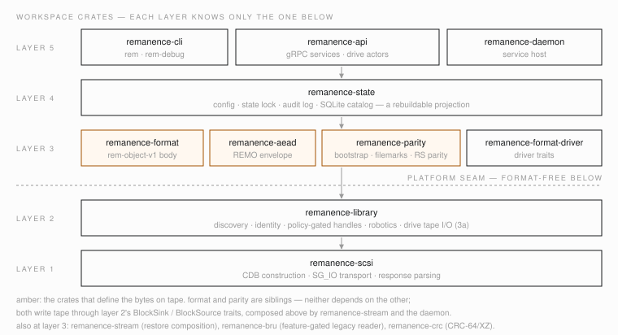

<!-- code-anchor: none -->
# Remanence — Open-Source LTO Tape Archival Software

Self-describing, catalog-rebuildable tape archives with optional 
encryption, erasure-coded media recovery, and partial-file restore. 
Designed for standards-based linear tape and currently validated on LTO.

[](https://doi.org/10.5281/zenodo.21551570)

**Website:** [archivetech.org](https://archivetech.org) — overview, the formats explained, and how to verify them.

Remanence is open Rust infrastructure for writing archives to LTO tape
and getting them back decades later. It is the mechanism layer of an
archive system: a daemon and CLIs that discover tape libraries, move
cartridges, write self-describing objects with erasure-coded parity, and
account for every byte in a rebuildable catalog. What to archive, when,
and for how long are deliberately not its decisions — those belong to
whatever orchestrator calls its API.

The project exists because the long-horizon archive niche is served
mostly by proprietary systems whose on-tape formats die with their
vendors, and by tooling that treats tape like a disk. Remanence takes
the opposite bets: the format on tape is published and readable with
stock `tar`, every tape self-describes so no database is ever the single
copy of the truth, and when the hardware leaves the software uncertain
about physical state, the software stops rather than guesses. The
reasoning is laid out in [docs/why-remanence.md](docs/why-remanence.md).

It is developed against a Quadstor virtual tape library and field-tested
on an HPE MSL3040 with LTO-9 drives.

<!-- code-anchor: none -->
## Status

Version 1.0.0, the first software release. The three on-tape formats are
specified, implemented, and pinned by test vectors that ship with the source.

Their specifications are published as review drafts. What is under review is
whether the documents describe the formats correctly and completely, not
whether the design works — but the documents are not final until they freeze on
31 July 2027, and the guarantee that no tape a format validates will ever be
invalidated begins then rather than now. Until then a review finding could
still change what goes on tape, so treat material written during the window as
re-writable rather than final. The daemon and its gRPC control surface are
released but may also still change.

The project is young, and has run on a narrow range of hardware. Restore and
verify real material on your own equipment before you rely on it.

[docs/status.md](docs/status.md) sets out what works today and what does not.

<!-- code-anchor: Cargo.toml @ f643f8c2 -->
## Build

Rust 1.85+, Linux. No system dependencies for the default build:

```sh
cargo build --release
```

yields `target/release/{rem,rem-debug,rem-daemon,rem-recover}`. `rem` is the
operator CLI and `rem-debug` the break-glass one that talks to hardware
directly; `rem-recover` is a separate crate that depends on neither the daemon
nor the catalog. One optional feature, `remanence-cli/linux-udev`, adds
hot-plug watching and needs `pkg-config` and `libudev-dev`.

Tests and lints, as CI runs them:

```sh
cargo fmt --all --check
cargo clippy --workspace --exclude remanence-chaos --all-targets -- -D warnings
cargo test --workspace --exclude remanence-chaos
```

Hardware-touching tests are ignored by default and opt in via
environment variables documented in their test modules.

<!-- code-anchor: crates/remanence-cli/src/lib.rs @ f643f8c2 -->
## Quickstart

The native object format works against local files, no tape required:

```sh
rem archive build --inputs some-directory --out demo.rem-object
rem archive inspect --object demo.rem-object
rem archive extract --object demo.rem-object --dest restored
```

`demo.rem-object` is a chunk-aligned POSIX pax tar stream — `bsdtar -tf
demo.rem-object` lists your files — and it is byte-for-byte what a tape write
stores as the object body. The full walkthrough, from local round trip
to library discovery, daemon setup, tape initialization, and a first
tape write, is [docs/guide-quickstart.md](docs/guide-quickstart.md).

## Documentation

- [Quickstart](docs/guide-quickstart.md) — runnable walkthrough.
- [Status](docs/status.md) — what works today, what does not, and how
  mature each part is.
- [Architecture overview](docs/architecture-overview.md) — the layer
  stack, write/read paths, and design invariants.
- [CLI reference](docs/reference-cli.md) — the `rem`, `rem-debug`, and
  `rem-daemon` surfaces.
- [Configuration reference](docs/reference-configuration.md) — every
  config key, default, and environment variable.
- [Foreign-format adapter reference](docs/reference-foreign-format-adapters.md)
  — the read-only registry boundary and distribution model.
- [Tape layout reference](docs/reference-tape-layout.md) — what is
  physically on a cartridge.
- [Troubleshooting](docs/guide-troubleshooting.md) — failure modes,
  fences, and permissions.
- [Glossary](docs/reference-glossary.md) — project terms and tape
  vocabulary.
- [How the formats change — and what never does](docs/versioning-explained.md)
  — the versioning and revision policy, in plain language.
- [The versioning register](docs/versioning-register.md) — every versioned
  component of the system, one entry each: current values, unknown-value
  behaviour, and how each ever changes.
- [The formats, explained](specs/publication/formats-explained.md) —
  a plain-language companion to the specifications: the motivation and
  the design, without the normative terseness.
- Published format specifications:
  [REM-OBJECT Core Format 1.0](specs/publication/rem-object-core-1-specification.md),
  [REM-ENCRYPT 1.0](specs/publication/rem-encrypt-1-specification.md), and
  [REM-PARITY 1.0](specs/publication/rem-parity-1-specification.md), with
  their pinned test-vector archive alongside.
- [proto/layer5.proto](proto/layer5.proto) — the draft gRPC contract.

<!-- code-anchor: crates/remanence-library/tests/platform_dependency_guard.rs @ f643f8c2 -->
## Migrating foreign tapes

Core Remanence publishes a read-only adapter registry but includes no concrete
foreign-format parser. A separate distribution can link the formats needed for
a particular migration while retaining the same normalized scan, restore,
recovery, and catalog surfaces. See the
[foreign-format adapter reference](docs/reference-foreign-format-adapters.md).

## Platform crate contract

`remanence-scsi` and `remanence-library` are the reusable tape-platform
crates, and they are format-free: no REM-OBJECT, parity, catalog, or daemon
knowledge lives below that seam. `remanence-scsi` depends on no other
Remanence crate, and `remanence-library` depends only on
`remanence-scsi`. A manifest dependency-guard test enforces the
boundary, so external tools can build their own layout and catalog on
the platform crates without pulling in the bundled formats. Portable
REM-OBJECT files follow the same discipline: they contain only the
object's stored bytes — tape filemarks, bootstrap rows, and parity
sidecars are tape-only framing.

<!-- code-anchor: Cargo.toml @ f643f8c2 -->
## Repository layout

```text
crates/remanence-scsi           Layer 1 SCSI CDB/SG_IO primitives
crates/remanence-library        Layer 2 library model/ops and Layer 3a tape I/O
crates/remanence-crc            Shared CRC-64/XZ
crates/remanence-aead           REM-ENCRYPT 1.0 encrypted-representation primitives (fixed REMO family magic; X-Wing HPKE wrapped-DEK)
crates/remanence-format-driver  Published format-driver traits and foreign-adapter registry
crates/remanence-format         Native rem-object-v1 body format
crates/remanence-parity         Layer 3c sidecar parity and recovery
crates/remanence-stream         Restore/recovery streaming composition
crates/remanence-state          Layer 4 catalog, audit, config, lock
crates/remanence-api            Layer 5 gRPC service implementations
crates/remanence-daemon         rem-daemon service host
crates/remanence-cli            rem and rem-debug binaries
crates/rem-recover       Standalone catalogless REM-OBJECT disaster-recovery binary
crates/remanence-chaos          Fault-injection scaffolding (excluded from CI gates)
specs/publication/              Published format specifications + test vectors
docs/                           Guides and references (see docs/README.md)
proto/                          Layer 5 protobuf contract
verif/                          Lean/Aeneas proof targets
fieldtest/                      Physical field-test kit and runbooks
fixtures/                       Captured hardware/SCSI fixtures
fuzz/                           REM-OBJECT fuzz targets
```



*Fig. 1 — The crate stack: each layer depends only on the one below it; the highlighted crates define the bytes on tape, and everything below the platform seam is format-free.*

## Contributing and security

Issues and pull requests are welcome — see
[CONTRIBUTING.md](CONTRIBUTING.md) for how the project works day to day.
To report a security issue, especially anything affecting the encryption
envelope or the integrity guarantees, see [SECURITY.md](SECURITY.md);
please do not open a public issue for suspected vulnerabilities.
Release history lives in [CHANGELOG.md](CHANGELOG.md). Released
versions are archived on Zenodo. To cite the software, use its concept DOI
[10.5281/zenodo.21551570](https://doi.org/10.5281/zenodo.21551570) (see
[CITATION.cff](CITATION.cff)). To cite a *format*, use that document's own
concept DOI, named in the document's Status section — the specifications are
deposited separately from the code, so that a citation of the format names an
immutable text rather than a software release.

## License

The Rust reference implementation is `Apache-2.0`, the specifications are
`CC-BY-4.0`, and the conformance vectors are `CC0-1.0`. See
[LICENSING.md](LICENSING.md) for the authoritative path mapping and canonical
license texts.
