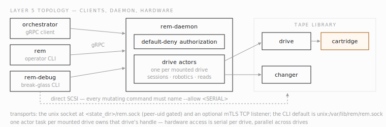

# Architecture overview

How the pieces of Remanence fit together, grounded in the code as it is
today. For byte formats see the [tape layout reference](reference-tape-layout.md);
for the historical design record see the layer design docs indexed in
[INDEX.md](INDEX.md).

<!-- code-anchor: Cargo.toml @ 2a20106 -->
## The layer model

Remanence is organized as a strict stack. Each layer only knows about the
one below it, and the two lowest layers are deliberately format-free so
other tools can build on them:

```text
Layer 5   remanence-api, remanence-daemon, remanence-cli
          gRPC services, drive actors, sessions, operator CLIs
Layer 4   remanence-state
          config, state lock, audit log, rebuildable SQLite catalog
Layer 3   remanence-format (3b: rao-v1 body)   remanence-parity (3c: parity)
          + remanence-aead (RAO1 HPKE envelope), remanence-format-driver (traits),
            remanence-bru (legacy reader), remanence-stream (composition)
Layer 2   remanence-library
          discovery, identity, policy-gated handles, robotics, tape I/O
Layer 1   remanence-scsi
          CDB construction, SG_IO transport, response parsing
```

Layers 3b and 3c are siblings, not stacked: both build on the
`BlockSink`/`BlockSource` traits that Layer 2 defines. The format writes
body blocks; the parity layer owns the physical tape layout around them
(bootstraps, filemarks, sidecars).

One crate sits outside the stack by design: `crates/rao-recover` is a
standalone disaster-recovery binary that links `remanence-aead`,
`remanence-format`, `remanence-library`, and `remanence-stream` directly,
skipping Layers 4 and 5 entirely. It exists so an encrypted RAO envelope can be
decrypted and restored with nothing but the object bytes and one matching
recipient private key — no daemon, no catalog, no config file — for the
scenario where the rest of the stack is unavailable or untrusted.


*Fig. 1 — The workspace as a strict stack: each layer depends only on the one below it, and the format-defining crates sit directly above the format-free platform seam.*

<!-- code-anchor: crates/remanence-scsi/src/lib.rs crates/remanence-library/src/lib.rs @ 2a20106 -->
## Layers 1 and 2: the tape platform

`remanence-scsi` is the leaf crate: it builds CDBs, dispatches them
through the Linux SG_IO ioctl, and parses responses (INQUIRY, READ
ELEMENT STATUS, sense data, mode pages, LOG SENSE, positioning). The
parsers are portable pure Rust; only the transport is Linux-gated.

`remanence-library` turns raw devices into a joined model. Discovery
issues READ ELEMENT STATUS to every changer and INQUIRY + VPD page 0x80
to every sg device, then joins them by serial number: "bay X of library L
holds drive S, reachable at /dev/sgN right now". Device paths are treated
as ephemeral; identity is always the serial, revalidated live when a
handle is opened. Handles gate every state-changing operation behind an
access policy (the allowlist) and track a dirty flag when a command's
completion is uncertain.

This crate also carries Layer 3a: drive tape I/O. There is exactly one
tape I/O path — a pipelined, fixed-block one; the earlier non-pipelined
mode and its `tape_io.legacy_single_block` config flag were deleted
outright (`config.toml` files that still set it, or the older
`tape_io.pipelined_submission` toggle, fail to load with a migration
error naming the removed key). "Pipelined" here means the staging ring
described under [The write path](#the-write-path) below, not concurrent
SCSI commands: exactly one command is ever in flight, a structural
consequence of one OS thread issuing blocking `sg_io` ioctls in
sequence. The block-I/O trait surface is deliberately split in two —
`BlockRead` (pure data transfer) and the richer `BlockSource` (adds
batch/handoff reads and `prove_read_position`, a real SCSI READ POSITION
proof) — so format-parsing code that only holds a `BlockRead` cannot
issue LOCATE, SPACE, or READ POSITION by type; a compile-fail test
enforces this. Readiness classification (bootstrap validation, media
state machine) and the udev hot-plug watcher also live here.

<!-- code-anchor: crates/remanence-library/tests/platform_dependency_guard.rs .github/workflows/ci.yml @ 7fb10f8 -->
### The platform seam

`remanence-scsi` and `remanence-library` are the reusable tape-platform
crates, and they are format-free by contract: no RAO, parity, catalog, or
daemon knowledge below this seam. The contract is enforced twice in the
tree: a manifest-parsing test asserts that `remanence-scsi` and
`remanence-aead` depend on no internal crate and that `remanence-library`
depends only on `remanence-scsi`; and CI asserts that the default builds
of the CLI and API do not pull the legacy BRU reader (that one guards the
`foreign-bru` feature seam). An external project can build its own layout
and catalog on the platform crates without inheriting Remanence's formats.

<!-- code-anchor: crates/remanence-format/src/lib.rs crates/remanence-parity/src/lib.rs crates/remanence-aead/src/lib.rs crates/remanence-format-driver/src/lib.rs crates/remanence-stream/src/lib.rs crates/remanence-bru/src/lib.rs crates/remanence-crc/src/lib.rs @ 2a20106 -->
## Layer 3: formats and parity

Six crates share this layer:

- `remanence-format` implements `rao-v1`, the native body format: one pax
  tar archive per stored object, chunk-aligned, self-describing, with a
  trailing CBOR manifest. It also implements partial-file reads that skip
  directly to a member's blocks, and a "covering range" computation that
  maps a requested plaintext byte range to the smallest span of AEAD
  chunks that must be fetched and decrypted to serve it.
- `remanence-aead` is the isolated crypto boundary: the `RAO1` encrypted
  format-version-2 envelope (HKDF-SHA-256 key derivation and a
  ChaCha20-Poly1305 STREAM). It generates a fresh per-object
  data-encryption key and wraps a copy of it to each recipient with HPKE
  (RFC 9180 Base mode,
  X25519-HKDF-SHA256-ChaCha20Poly1305) in a `RAOK`-tagged key frame
  between the header and metadata frame. Readers accept 1-8 slots;
  production sealers require 2-8 distinct epochs. There is no shared
  secret, and format version 1 is permanently rejected as unsupported.
  The crate depends on no other Remanence crate, so the envelope is
  auditable on its own. Its whole-object and ranged primitives are
  wrapped by `remanence-format`, which is the funnel used by the CLI,
  API, and `rao-recover`.
- `remanence-parity` owns the physical tape layout: bootstrap blocks,
  filemark discipline, Reed-Solomon sidecar parity, resume, and the
  catalog-less scan that reconstructs a tape's structure from the media
  alone. On clean reads it is transparent; on medium errors it
  reconstructs missing blocks.
- `remanence-format-driver` publishes the driver traits (probe, scan,
  restore, recover) that native and foreign formats implement.
- `remanence-bru` is the one foreign driver so far: a read-only reader
  for legacy BRU/BRU-PE archives, used for migrating old tapes. It is
  feature-gated (`foreign-bru`) and excluded from default builds.
- `remanence-stream` composes 3b and 3c for whole-file workflows:
  prepass local files, stream them through format plus parity, project
  catalog rows, and restore objects back to a directory (including
  sparse recovery of damaged archives).
- `remanence-crc` is the shared CRC-64/XZ used by the parity structures
  and the audit log.

`archive build` and pool-selected `archive write` produce the encrypted
representation when given
2-8 ordered `--recipient` RAOR files; omitting recipients keeps the body
plaintext. `archive reseal` performs a full re-seal to rotate recipients. Whole,
streaming, and ranged opens use a RAOP `--private-key`; its epoch id selects
the matching key-frame slot. `rao-recover` provides the same encrypted open without
the daemon, catalog, or config.

<!-- code-anchor: crates/remanence-state/src/lib.rs crates/remanence-state/src/state.rs @ 2a20106 -->
## Layer 4: state

`remanence-state` holds everything the daemon remembers: the validated
operator config, an advisory state lock, the append-only audit log, and
the SQLite catalog. The catalog is explicitly a projection —
`rebuild_index_from_journals` replays the audit log and per-tape
journals to regenerate it, and opening it read-only refuses to migrate.
Schema version 12 today, tracked in SQLite's `user_version`, with tables
for tapes, pools, tape files, objects/copies/files, catalog units,
sessions, operations, idempotency keys, media-readiness records,
tape-I/O fences, and the drive-stewardship set (drives, events, health
snapshots, clean runs, alarms).

The state lock is **not** taken by `rem-daemon` itself — only
`StateHandle`-based `rem-debug` state-mutating subcommands (tape init,
pool ops, catalog reset, and similar offline operations) acquire the
kernel `flock` on `<state_dir>/state.lock`, which serializes those
commands against each other and is released automatically if the
holding process dies. `rem-daemon` opens the SQLite catalog directly and
never takes this lock; its only guard against a second instance is a
liveness probe on the Unix socket path at bind time (a live listener at
that exact path is a hard error, a stale socket file is unlinked and
reused). Two daemons configured with different socket paths but the same
`state_dir` are not stopped from both starting — this is a known gap,
not a documented safety property.

<!-- code-anchor: proto/layer5.proto crates/remanence-api/src/lib.rs crates/remanence-daemon/src/lib.rs @ 2a20106 -->
## Layer 5: daemon and API

The gRPC contract (package `remanence.api.v1`, defined in
`proto/layer5.proto`) is still an implementation draft with no
wire-stability promise. `rem-daemon` serves five of its six services
today:

| Service | Surface |
|---|---|
| `Daemon` | health, version, operation lifecycle (get/list/cancel/watch) |
| `LibraryService` | inventory, drive stewardship, alarms, live status (incl. an advisory `drive_assignments` projection of the per-bay reservation state, for an external arbitration client — read-only, cannot gate a mount), robotics (move/load/unload); `ImportElement`/`ExportElement` and `StreamLibraryEvents` are defined but return unimplemented |
| `Catalog` | tapes, pools, tape files, object enumeration, catalog units, reconcile; scoped/paginated enumeration is not wired yet (only the unscoped, unpaginated case works) |
| `WriteSessionService` | open (pool targets only — drive/tape targets are unimplemented), client-streamed append, explicit checkpoint, close, abort; opt-in batched durability is parity-off only, and write-session restart (`recover_session_id`) remains unimplemented — RM3's app-restart contract below covers reads only |
| `ReadSessionService` | open (tape targets only), server-streamed object/file/byte-range reads, close; `OpenReadSession` accepts an optional resume target so a client that lost its session across a restart can reopen against durable coordinates (tape UUID, object/file id, file-boundary offset) instead — see [The read path](#the-read-path) |
| `Audit` | defined in the proto; not yet served by the daemon (no service impl registered at all) |

Transports: a Unix socket (peer-uid gated to root or the daemon user,
mode 0660, with 4 MiB HTTP/2 flow-control windows and a 30s/20s
keepalive interval/timeout) and an optional mTLS TCP listener with the
same settings. Authorization is default-deny: a client role arrives
either from the mTLS certificate (an explicit `remanence-role=` subject
attribute, never a bare CN) or, on the trusted local socket, as the
system role, and every RPC checks a 6-permission matrix (`Read`,
`ReadTape`, `Write`, `Robotics`, `Lifecycle`, `OperationControl`) before
touching state.

Inside `remanence-api`, each mounted drive is a dedicated actor task that
owns its drive handle; sessions, robotics, and reads are messages to that
actor. This serializes hardware access per drive while letting multiple
drives run in parallel.



*Fig. 2 — Layer 5 topology: clients reach `rem-daemon` over the unix socket or mTLS TCP, every RPC passes the default-deny role check, and one actor per mounted drive serializes hardware access; `rem-debug` keeps an allowlist-gated direct SCSI path for break-glass work.*

<!-- code-anchor: crates/remanence-api/src/mount.rs crates/remanence-api/src/pool_write.rs crates/remanence-api/src/write_owner.rs crates/remanence-state/src/index.rs @ 2a20106 -->
## The write path

What happens when an orchestrator writes an object:

1. `OpenWriteSession` names a tape pool. The daemon selects a tape by the
   pool's policy and watermarks, reserves it, robots it into a free
   drive, and hands the session to that drive's actor.
2. The actor prepares the drive: rewind, read the bootstrap at BOT, and
   verify the tape UUID matches the catalog's expectation. A tape that
   cannot prove its identity is never written.
3. `AppendObject` streams chunks, which the daemon spools to a private
   staging file (mode 0700, `spool-<uuid>.bin`) under a byte budget
   shared with every read reservoir on the daemon (`daemon.io_memory_ceiling`,
   default 24 GiB) — a tmpfs spool additionally needs an operator-acked
   `spool_tmpfs_ram_budget` and is clamped to the ceiling, not to live
   `MemAvailable`. The daemon verifies the caller's declared SHA-256
   against the received bytes before anything touches tape. On startup,
   `rem-daemon` deletes its own daemon-owned leftover spool files from a
   prior unclean exit before resolving the budget.
4. The object is laid out as a plaintext `rao-v1` body or sealed as a
   recipient envelope, then
   written through the parity sink. Tape I/O itself is pipelined: a
   fixed pool of page-aligned staging-ring buffers (`tape_io.staging_ring_buffers`,
   default 4) is filled by a producer thread while a submitter issues
   one blocking `WRITE(6)` batch at a time — there is no
   non-pipelined fallback — with a synchronous, in-place byte/position
   accounting update after every successful command and a periodic real
   READ POSITION tripwire (`tape_io.position_check_bytes`, default
   1 GiB) that catches silent position drift. The object is terminated
   with a filemark; parity sidecars follow per the scheme.
5. Commit is one SQLite transaction that projects the object, copy, file
   rows and the tape-file bundle after the tape write completed. The
   locator returned to the caller pins the copy to physical media.
6. Failures fail closed, at three layers: a poisoned staging-ring
   transfer discards any batches still queued for that one `AppendObject`
   call once the first sink error occurs; a poisoned `AppendGate` fails
   every subsequent append for the rest of that write session (permanent
   until the caller opens a new session); and completion-unknown
   transfer errors record a durable tape-I/O fence that blocks further
   writes — and daemon startup — until an operator releases it.

Idempotency: a repeat of the same `(pool, caller_object_id)` with the
same content returns the committed copy instead of writing twice;
different content under a reused id is a conflict. Write sessions have
no restart/resume contract — `recover_session_id` is rejected as
unimplemented, unlike the read side below. In batched mode a WRITTEN response
is advisory and locator-free; callers retain the source until
`CheckpointSession` returns the committed copy set, and re-send every object
that was not reported CHECKPOINTED after any session, stream, or daemon loss.
Each batched barrier writes a non-final no-parity checkpoint bootstrap on tape
with the authenticated filemark-map prefix and every committed RAO object row,
then drains deferred drive errors with synchronous `WRITE FILEMARKS(0)` and
captures `READ POSITION`. The daemon fsyncs that EOD and the replayable batch
projection to its per-tape checkpoint journal before one SQLite transaction.
Recovery trusts the journal, LOCATEs to its EOD, and overwrites any later
physical tail; the on-tape bootstrap is the tape-alone recovery copy.

<!-- code-anchor: crates/remanence-api/src/read_core.rs crates/remanence-api/src/write_owner.rs @ 2a20106 -->
## The read path

`OpenReadSession` resolves the object to a tape, mounts it, and
re-verifies the loaded tape's identity before serving. Reads space
directly to the recorded tape file and stream the payload out in bounded
chunks without materializing the object in memory; file- and byte-range
reads skip to the member's chunk-aligned blocks. Parity stays out of the
way unless a medium error forces reconstruction.

Every read session always mints a brand-new session id — there is no
session continuation. What a client *can* do across a lost session (an
app restart, most commonly) is present a **resume target** instead of
starting cold: `(tape_uuid, object_id, file_id, file_boundary_byte_offset)`,
plus optionally the LBA it last expected. The daemon treats this as a
fresh open with different positioning: it re-verifies the mounted tape's
on-tape UUID against the target's **before** trusting any position (so a
swapped or stale cartridge is rejected even if it happens to have a
matching LBA), rejects any offset that doesn't land exactly on a
catalogued file boundary (no mid-file resume), spaces to that boundary,
and returns a real device position proof — a SCSI READ POSITION result,
not an arithmetic estimate — alongside the new session and the daemon's
own epoch counter (so a client can detect it's now talking to a
restarted daemon instance).

Delivery is backpressured through a host-RAM reservoir, not an unbounded
channel. A submitter thread fills a shared reservoir up to a high
watermark (`tape_io.read_reservoir_bytes`, default 8 GiB; high/low
watermarks default 90%/25%), then parks the drive until the consumer
drains it below the low watermark — and re-proves its device position
with a real READ POSITION on every resume from a park, not just
periodically. Byte-range reads additionally withhold delivering data to
the decoder until a proof has "covered" it (a proof-frontier check), so
a caller streaming a range never receives bytes the drive hasn't
actually confirmed reaching. The reservoir draws from the same
`daemon.io_memory_ceiling` budget as the write-side spool. Every pipeline
run emits two structured JSON diagnostic log lines (`open` and `close`,
target `remanence_read_diag`) with occupancy, park-cycle, and feed-gap
timing fields — see [Troubleshooting](guide-troubleshooting.md) for how
to read them.

For a range that has already been fetched as raw ciphertext, decrypting
just that slice does not require a live tape session at all:
`remanence-aead`'s covering-range computation maps the requested
plaintext range to the minimal span of AEAD chunks that cover it, and a
bounded streaming decrypt authenticates and trims exactly those chunks —
this is what the CLI's `archive covering-range`/`archive extract-stream`
pair does locally, decoupled from any gRPC read session.

<!-- code-anchor: none -->
## Design invariants worth internalizing

- **The tape is the authority.** Every tape self-describes (bootstrap,
  manifest, sidecars); the host catalog is a rebuildable projection.
  Losing the SQLite file loses no data.
- **Identity over enumeration.** Serials and UUIDs everywhere; `/dev/sg7`
  and barcodes are labels, resolved fresh and never trusted as identity.
- **Refuse to guess.** Uncertain completion marks state dirty or writes a
  fence. The failure surface is explicit because the worst archival
  outcome is "looks fine, isn't".
- **Policy lives above.** Remanence decides how bytes get on tape safely,
  not what to archive or when. Retention, scheduling, and workflow belong
  to the orchestrator calling the API.

<!-- code-anchor: crates/remanence-chaos/src/lib.rs @ 7fb10f8 -->
## Testing infrastructure

`remanence-chaos` wraps any SCSI transport with scenario-driven fault
injection (armed from a SQLite state file, double-gated by environment
variables so it can never engage accidentally in production) and provides
a stateful in-memory model of a drive-plus-changer for hermetic tests.
The workspace's unit and integration tests run against captured hardware
fixtures and that model; hardware-touching tests are `#[ignore]`d and
opt-in via environment variables. Formal verification of the parity,
format, and manifest cores lives under `verif/` (Lean/Aeneas), inventoried
in [formal-verification-status.md](formal-verification-status.md).
