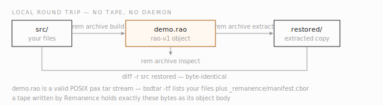

# Quickstart

This walkthrough goes from a clean checkout to a verified archive
round trip on your local disk, then to real hardware. The local part
needs no tape drive, no library, and no elevated privileges — the native
object format works against ordinary files, and it is the same code path
the tape write uses.

Commands in the local sections were run as written against the current
tree; hardware sections are marked, because they need a library (real or
virtual) and host privileges.

<!-- code-anchor: Cargo.toml crates/remanence-cli/Cargo.toml @ 2a20106 -->
## Build

You need Rust 1.85 or newer. The workspace builds on stock Linux with no
system dependencies:

```sh
git clone https://github.com/archivetechie/remanence
cd remanence
cargo build --release
```

That produces four binaries under `target/release/`: `rem` (operator
CLI), `rem-debug` (break-glass CLI), `rem-daemon` (the service), and
`rao-recover` (a standalone catalogless disaster-recovery tool — see the
[CLI reference](reference-cli.md#rao-recover-standalone-recovery)).

Two optional cargo features widen the surface:

- `--features remanence-cli/linux-udev` enables `rem watch` (hot-plug
  events); it needs the `pkg-config` and `libudev-dev` system packages.
- `--features remanence-cli/foreign-bru` compiles in the legacy BRU
  archive reader and its `--format bru` commands.

To run the test suite the way CI does:

```sh
cargo fmt --all --check
cargo clippy --workspace --exclude remanence-chaos --all-targets -- -D warnings
cargo test --workspace --exclude remanence-chaos
```

Hardware and large-memory tests are `#[ignore]`d by default and opt in
through environment variables documented in their test modules.

<!-- code-anchor: crates/remanence-cli/src/lib.rs crates/remanence-cli/src/archive_ingest.rs @ 2a20106 -->
## First archive, no tape required

Build a stored object from a directory, look inside it, and restore it.
Make some input:

```sh
mkdir -p demo/src/photos
echo "first file" > demo/src/notes.txt
head -c 100000 /dev/urandom > demo/src/photos/img001.raw
cd demo
```

Build a RAO object:

```sh
rem archive build --inputs src --out demo.rao
```

The command prints a JSON build report: the object id, the chunk size
(262144 bytes by default), and one entry per file with its SHA-256, size,
and position inside the object. This report is what an orchestrator would
store; every field in it is also recoverable from the object itself.

Inspect the object without extracting it:

```sh
rem archive inspect --object demo.rao
```

Then restore and compare:

```sh
rem archive extract --object demo.rao --dest restored
diff -r src restored && echo identical
```

Two properties worth noticing. First, `demo.rao` is a valid POSIX pax tar
stream padded to fixed-size chunks — `bsdtar -tf demo.rao` lists your
files plus a `_remanence/manifest.cbor` index entry. A tape written by
Remanence holds exactly these bytes as its object body, which is the
30-year-readability story: no Remanence software is needed to get the
data back. Second, every file's SHA-256 travels with it, so verification
never depends on host state.



*Fig. 1 — The local round trip: build a rao-v1 object from a directory, read it back, and prove the copies identical — the same bytes a tape write stores as the object body.*

<!-- code-anchor: crates/remanence-cli/src/lib.rs crates/remanence-aead/src/lib.rs crates/remanence-aead/src/wrap.rs crates/remanence-aead/src/xwing.rs @ 8de2c46 -->
## The encrypted variant

The encrypted representation wraps the same tar stream in an
authenticated ChaCha20-Poly1305 envelope. This is the only encrypted
representation: every
object gets a fresh data-encryption key, wrapped separately to each
recipient with HPKE (RFC 9180 Base mode, HKDF-SHA256, ChaCha20-Poly1305)
running the X-Wing post-quantum/classical hybrid KEM (ML-KEM-768
combined with X25519). Writers require 2-8 distinct recipient epochs in
ascending slot order.

Remanence consumes canonical RAOR public-key files and RAOP private-key
files; key-pair provisioning belongs to the custodian/key-registry tooling,
not this CLI. Assuming two custodians supplied `primary.raor` and
`recovery.raor`, build the encrypted object directly:

```sh
rem archive build --inputs src --out demo-enc.rao \
    --recipient primary.raor --recipient recovery.raor
rem archive inspect --object demo-enc.rao
rem archive extract --object demo-enc.rao --dest restored-enc \
    --private-key primary.raop
diff -r src restored-enc && echo identical
```

`inspect` needs no key. It validates the envelope header and key frame and reports
the ordered `recipient_epochs`, but cannot expose the encrypted manifest.
The matching RAOP file selects its epoch's slot during open.

To rotate recipients, open the existing encrypted object with one current private
key and reseal it to a new 2-8-recipient set:

```sh
rem archive reseal --object demo-enc.rao --private-key primary.raop \
    --recipient primary-rotated.raor recovery.raor \
    --out demo-rotated.rao
```

`reseal` performs a full re-seal: it verifies the new stored digest before
publishing and never overwrites an existing output. It always emits an encrypted
envelope.

For catalogless disaster recovery, use the standalone `rao-recover` binary
with any matching recipient private key:

```sh
rao-recover --object demo-enc.rao --private-key recovery.raop --out recovered
diff -r src recovered && echo identical
```

`rao-recover` needs no daemon, catalog, or config file — it's the
disaster-recovery path of last resort. For streaming and partial retrieval,
`archive extract-stream` and `archive covering-range` use the same
`--private-key` epoch-selection contract.

<!-- code-anchor: crates/remanence-library/src/discovery.rs crates/remanence-cli/src/lib.rs Makefile @ 2a20106 -->
## Talking to a library (requires hardware)

From here on you need a tape library — a real chassis or a virtual one
(the project develops against QuadStor VTL). Two host-side gates must be
open before any SCSI command works:

1. Your user must be in the `tape` group (this gates opening
   `/dev/sgN`): `sudo usermod -aG tape $USER`, then log in again.
2. The binary needs `CAP_SYS_RAWIO` (the kernel filters most SCSI
   opcodes for everyone else): `sudo setcap cap_sys_rawio+ep
   target/release/rem`.

Rebuilding drops the capability with the binary's inode; `make rem-dev`
rebuilds the debug binary and reapplies it in one step. If you skip these
gates, discovery fails with an explicit EPERM hint — see
[troubleshooting](guide-troubleshooting.md).

Now discover:

```sh
rem libraries
```

Each line is one library with its serial, model, changer device, and
shape (drives, slots, IE ports, loaded cartridges). Focus on one, with
its slot map:

```sh
rem library <SERIAL> --slots
```

Both commands take `--json` for scripting. Discovery is read-only: it
issues INQUIRY, VPD, and READ ELEMENT STATUS, and moves nothing.

<!-- code-anchor: crates/remanence-daemon/src/main.rs crates/remanence-state/src/config.rs @ 2a20106 -->
## Running the daemon (requires hardware)

The daemon needs a config file. A minimal one, using `/var/lib/rem` for
state (see the [configuration reference](reference-configuration.md) for
every key):

```toml
[daemon]
state_dir = "/var/lib/rem"
default_idle_timeout_seconds = 300

[[libraries]]
serial = "<SERIAL>"          # from `rem libraries`; the daemon only
                             # touches libraries listed here

[[tape_pools]]
id = "demo"

[[tape_pool_rules]]
prefix = "DMO"               # barcodes DMO... belong to pool "demo"
pool_id = "demo"

[journal]
dir = "/var/lib/rem/journal"

[audit]
dir = "/var/lib/rem/audit"

[index]
sqlite_path = "/var/lib/rem/rem-state.sqlite"

[cache]
tape_catalog_dir = "/var/lib/rem/tape-catalog"
```

Start it in the foreground:

```sh
rem-daemon --config /etc/rem/config.toml
```

It logs JSON to stderr and announces `serving local Layer 5 API on
unix:/var/lib/rem/rem.sock`. Under systemd, grant the SCSI capability in
the unit rather than on the binary:

```ini
[Service]
AmbientCapabilities=CAP_SYS_RAWIO
CapabilityBoundingSet=CAP_SYS_RAWIO
```

Check it from another shell:

```sh
rem daemon health
rem daemon version
rem catalog pools
```

If your state dir is not `/var/lib/rem`, pass `--endpoint
unix:<state_dir>/rem.sock` — the CLI default assumes that path.

<!-- code-anchor: crates/remanence-cli/src/lib.rs crates/remanence-api/src/tape_init.rs @ 2a20106 -->
## Initializing a tape (requires hardware, writes to media)

A fresh cartridge must be initialized before a pool will accept it:
Remanence writes the bootstrap block at the beginning of tape, binding a
new tape UUID to the barcode in the catalog. Initialization is
destructive by nature, so it runs a safety gauntlet — identity,
ownership, readiness, and data-presence checks — and refuses anything it
cannot prove. Start with a dry run, which performs every check and
writes nothing:

```sh
rem tape init DMO001L9 --dry-run
rem tape init DMO001L9
```

Batch initialization takes a slot range (`rem tape init
0x0400..0x0407`). Overrides are deliberately narrow: `--force` only
covers decisions the gauntlet classifies as force-overridable, and
`--clobber-data` (for a tape that verifiably holds data) is refused in
dry-run and batch modes.

One hardware reality to plan around: the first load of a new LTO-9
cartridge triggers a one-time media optimization pass in the drive that
can take an hour or more. `rem tape wait-ready --wait` polls until the
medium is genuinely usable, and its defaults (2.5h timeout, 30s
interval) are sized for exactly this.

<!-- code-anchor: crates/remanence-cli/src/rem_debug.rs @ 7fb10f8 -->
## First write to tape (requires hardware, writes to media)

The daemon's write path is a gRPC session for orchestrators; for a
first hands-on write, `rem-debug` drives the same pool machinery from
the command line. Note the `--allow` flag: every state-changing
`rem-debug` command must name the library it may touch.

```sh
rem-debug --allow <SERIAL> archive write \
    --library <SERIAL> --pool demo --file /path/to/payload.bin --json \
    --recipient primary.raor --recipient recovery.raor \
    > locator.json

rem-debug --allow <SERIAL> archive verify \
    --library <SERIAL> --locator "$(cat locator.json)" \
    --private-key primary.raop \
    --expected-sha256 "$(sha256sum /path/to/payload.bin | cut -d' ' -f1)"

rem-debug --allow <SERIAL> archive read \
    --library <SERIAL> --locator "$(cat locator.json)" --out restored.bin \
    --private-key primary.raop
```

The locator JSON emitted by `write` pins the object copy to physical
media and records `format_version: 2` plus the recipient epochs; `verify`
streams and authenticates the tape object against a digest without restoring
anything.

## Where to go next

- [CLI reference](reference-cli.md) — the full command surface.
- [Configuration reference](reference-configuration.md) — every config
  key, default, and environment variable.
- [Architecture overview](architecture-overview.md) — how the crates
  fit together and what the write path actually does.
- [Tape layout reference](reference-tape-layout.md) — what ends up on
  the cartridge.
- [Troubleshooting](guide-troubleshooting.md) — the failure modes and
  what they mean.
