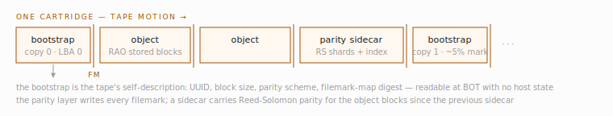
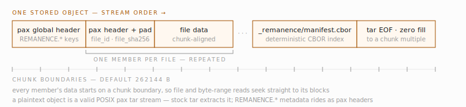
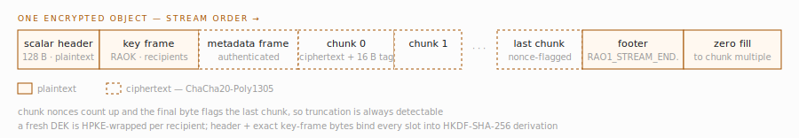

# On-tape layout reference

What a Remanence-written cartridge physically contains, as the code writes
it today. Byte-level detail lives in the published specifications —
[RAO 1.0](../specs/rao-1.0-specification.md),
[RAO 1.1](../specs/rao-1.1-specification.md), and
[REM-PARITY 1.0](../specs/rem-parity-1.0-specification.md) — this page is
the orientation layer above them.

The design goal behind all of it: a tape must be readable with no access
to Remanence's host state. Everything the catalog knows is either written
to the tape itself or rebuildable from journals; the SQLite index is a
cache, never the truth.

<!-- code-anchor: crates/remanence-parity/src/filemark_map.rs crates/remanence-parity/src/sink.rs crates/remanence-parity/src/bootstrap.rs @ 7fb10f8 -->
## Tape files and filemarks

A cartridge is a sequence of tape files separated by filemarks, written in
fixed-size blocks. Four kinds of tape file exist (their codes are stable
on tape): `Object` (0), `ParitySidecar` (1), `Bootstrap` (2), and
`ParityMap` (3).

- **Bootstrap** blocks are the tape's self-description. Copy 0 always sits
  at LBA 0 — the beginning of tape — and further copies are spread down
  the tape at roughly 5% capacity intervals. A bootstrap records the tape
  UUID, the fixed block size, the parity scheme, a digest of the filemark
  map, a sequence number, and the writer version. Because the block size
  is in the bootstrap, a reader never needs MODE SENSE state to start; a
  scan just probes the candidate block sizes (256 KiB, 512 KiB, 1 MiB) at
  BOT.
- **Object** tape files contain only body-format blocks (a stored RAO
  object). The parity layer owns every filemark; body formats cannot emit
  them.
- **Parity sidecar** tape files carry the Reed-Solomon parity shards and
  index for the data written since the last sidecar.
- **Parity map** tape files are a directory of sidecar epochs, written
  when the map no longer fits inline in the bootstrap.

*Fig. 1 — One cartridge in tape-motion order: bootstrap copy 0 at LBA 0, object and parity-sidecar tape files separated by parity-layer filemarks, and bootstrap copies repeating at roughly 5% capacity intervals.*

The only fixed literal on tape is the bootstrap magic, the 8 bytes
`52 45 4D 00 42 4F 4F 01` (`REM\0BOO\x01`). Sidecar, sidecar-footer, and
parity-map magics are derived per tape as the first 8 bytes of an
HMAC-SHA-256 keyed by the tape UUID, so blocks from one tape cannot
masquerade as another's. All parity-layer structures carry CRC-64/XZ
checksums.

<!-- code-anchor: crates/remanence-parity/src/lib.rs crates/remanence-parity/src/sidecar.rs @ 7fb10f8 -->
## Parity scheme

Erasure coding is Reed-Solomon over GF(2^8) with a Cauchy matrix; the
scheme id written to tape is `rs-cauchy-gf256-v1`. A scheme is the triple
(data blocks per stripe, parity blocks per stripe, stripes per
neighborhood). The defaults at the standard 256 KiB block size:

| Scheme | k | m | Stripes/neighborhood | Tolerance |
|---|---|---|---|---|
| `default` | 128 | 4 | 512 | ~512 MiB of loss per neighborhood |
| `conservative` | 64 | 6 | 256 | ~384 MiB, higher parity overhead |
| `none` | — | — | — | bootstrap written with a no-parity flag |
| `custom:k,m,S` | k | m | S | operator-chosen |

Parity-protected writes require LTO hardware compression disabled on the
drive; compression would decouple logical block counts from physical
media, and the stripe geometry is physical.

Checkpoint barriers close the current epoch even when it is short. On a
parity pool, a batch-of-one workload therefore pays for one short-epoch
sidecar (up to `m` parity shards per populated stripe), one checkpoint
edition block, and their filemarks for every object. Its directory grows at
roughly two rows per object and reaches the inline ceiling about twice as
soon as a well-batched workload. Heavy sync callers should batch; admission
reserves worst-case directory and stop headroom, so reaching the ceiling
seals and rolls placement at a checkpoint instead of failing an open batch.

<!-- code-anchor: crates/remanence-format/src/model.rs crates/remanence-format/src/layout.rs crates/remanence-format/src/writer.rs @ 7fb10f8 -->
## The stored object: rao-v1

A plaintext stored object is a POSIX pax tar archive — the format id is
`rao-v1`, schema version `1.0` (`1.1` when per-entry xattrs are present).
There is no custom binary header: identity travels in a pax global
extended header with `REMANENCE.*` keys (`format_id`, `schema_version`,
`object_id`, `caller_object_id`, `chunk_size`, `encryption`,
`write_timestamp`, `metadata_preservation`). Each member carries
`REMANENCE.file_id`, `REMANENCE.file_sha256`, and chunk-alignment padding
so that every member's data starts on a chunk boundary (default chunk
size 262144 bytes). The last member is a deterministic CBOR manifest at
`_remanence/manifest.cbor`, followed by tar end-of-archive records.

The consequence worth stating plainly: a plaintext rao-v1 object is
extractable with stock `tar` on any Unix system, with the Remanence
metadata visible as pax headers. The 30-year-readability property is not
a promise, it is the format.

*Fig. 2 — A rao-v1 stored object in stream order: identity in the pax global header, one chunk-aligned member per file, the CBOR manifest as the last member, then tar end-of-archive records padded to a chunk multiple.*

<!-- code-anchor: crates/remanence-aead/src/header.rs crates/remanence-aead/src/stream.rs crates/remanence-aead/src/kdf.rs @ 2a20106 -->
## The encrypted envelope: RAO1

An encrypted object wraps the same tar byte stream in an AEAD envelope.
The live wire format is version 2 only (cipher-suite id `0x01`,
HKDF-SHA-256 + ChaCha20-Poly1305). Format version 1 is permanently reserved
and rejected with `UnsupportedFormatVersion`; there is no compatibility
reader or writer.

- The fixed plaintext scalar header is 128 bytes. Bytes `0x10..0x20` are
  reserved and must be zero. Byte `0x38` is wrap-suite id `0x01` (HPKE,
  RFC 9180 Base mode, X25519-HKDF-SHA256-ChaCha20Poly1305), bytes
  `0x39..0x3c` are reserved-zero, and `0x3c..0x40` holds the key-frame
  length.
- A plaintext **key frame** follows immediately (wire tag `RAOK`). Readers
  accept 1-8 slots; production sealers require 2-8 distinct recipient
  epochs in ascending slot order. Each slot is
  `[slot_index][recipient_epoch_id:16][label][enc:32][ciphertext:48]` and
  carries one HPKE-wrapped copy of the object's freshly generated 32-byte
  data-encryption key (DEK).
- An authenticated metadata frame, then the payload as an age-style
  STREAM: each chunk is `chunk_size` bytes of ciphertext plus a 16-byte
  tag, with an 11-byte counter nonce whose final byte flags the last
  chunk (computed against the whole object's chunk count, so a partial
  ranged read still nonces correctly). Truncation is therefore
  detectable.
- A 16-byte plaintext footer, `RAO1_STREAM_END.`, then zero-fill to a
  chunk-size multiple.

*Fig. 3 — The encrypted RAO1 envelope around the same tar stream. The scalar header,
recipient key frame, footer, and fill are plaintext framing; metadata and
payload chunks are ChaCha20-Poly1305 ciphertext. The key frame is bound into
key derivation, so changing any slot invalidates authentication.*

The envelope has no shared root key. Its labels (`rao2-salt-v1` and siblings)
derive from the per-object DEK, and the derivation hash covers the scalar
header plus the exact key-frame bytes. `archive build` and pool writes seal
directly to recipients, while `archive reseal` performs a full re-seal to a
new recipient set. CLI open/read/verify paths and standalone `rao-recover`
select a slot using the RAOP private key's epoch id; see the [CLI
reference](reference-cli.md#rao-recover-standalone-recovery).

<!-- code-anchor: crates/remanence-parity/src/bootstrap.rs crates/remanence-state/src/index.rs @ 7fb10f8 -->
## Tape identity

A tape's durable identity is the 16-byte UUID in its bootstrap at BOT,
written once at initialization. The barcode (voltag) is deliberately not
written to tape — barcodes are library-inventory labels, and the binding
voltag ↔ tape UUID lives in the catalog's `tapes` table. This is what
makes identity library-independent: move a cartridge to another library
and it is still the same tape. It is also the root of the known
recycle-skew issue when something outside Remanence rewrites a cartridge
under an existing barcode (see
[troubleshooting](guide-troubleshooting.md#known-open-issue)).

<!-- code-anchor: crates/remanence-state/src/index.rs crates/remanence-state/src/paths.rs @ 7fb10f8 -->
## On disk: the rebuildable state

The host-side state, for completeness (paths are operator-configured; see
the [configuration reference](reference-configuration.md)):

- **Per-tape journals** (`<tape-uuid>.remjournal`) — the durable
  disk-side record of what was committed to each tape.
- **Audit segments** (daily `.remaudit` files) — append-only record of
  every state-changing operation, fsynced by default.
- **SQLite index** — schema version 12, tracked via `PRAGMA
  user_version`, with tables for tapes, pools, tape files, objects and
  copies, catalog units, sessions, operations, idempotency keys, media
  readiness, tape-I/O fences, drives, cleaning runs, and alarms. It is a
  projection: `rem rebuild-catalog-from-journals` regenerates it from the
  journals and audit log.
- **Per-tape catalog caches** — regenerable per-tape files under the
  configured cache directory.
