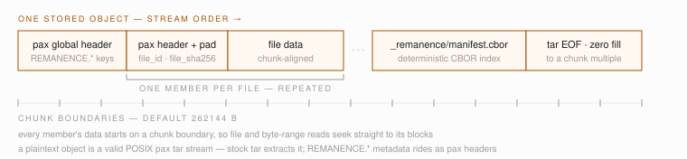
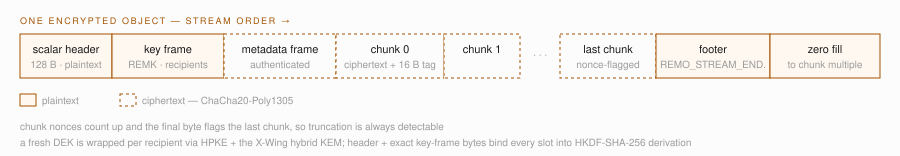

# On-tape layout reference

What a Remanence-written cartridge physically contains. Byte-level detail for
the stable formats lives in the published specifications —
[REM-OBJECT Core](../specs/publication/rem-object-core-1-specification.md),
[REM-ENCRYPT](../specs/publication/rem-encrypt-1-specification.md), and
[REM-PARITY 1.0](../specs/publication/rem-parity-1-specification.md). The
terminal triple index described below is the experimental draft.4 replacement;
its candidate byte tables are in the
[in-progress byte draft](../specs/in-progress/supporting/rem-parity-terminal-index-byte-draft.md).
It is not part of the unchanged publication baseline.

The design goal behind all of it: a tape must be readable with no access
to Remanence's host state. Everything the catalog knows is either written
to the tape itself or rebuildable from journals; the SQLite index is a
cache, never the truth.

<!-- code-anchor: crates/remanence-parity/src/terminal_tail.rs crates/remanence-parity/src/tape_index_replica.rs crates/remanence-parity/src/index_separation.rs -->
## Tape files and filemarks

A cartridge is a sequence of tape files separated by filemarks, written in
fixed-size records. Six structural kinds are emitted by the replacement draft:
`Object` (0), `ParitySidecar` (1), `Bootstrap` (2), `ParityMap` (3),
`TapeIndexReplica` (4), and `IndexSeparationExtent` (5).
Scale-derived file numbers, block counts, data ordinals, edition sequences,
and logical-block positions are carried as `u64`. Closed-topology fields use
their bounded widths instead: replica/gap ordinals and component kinds are
`u16`, while partitions and block sizes are `u32`. The closed block-size
profile remains 256 KiB, 512 KiB, and 1 MiB.

- **Bootstrap** at tape file 0 is the volume label and geometry root: tape UUID,
  fixed block size, and parity profile. It is Object-count independent and
  contains no Object recovery rows, including on a no-parity tape. Host
  checkpoint operations do not emit a Bootstrap. The terminal design does not write
  intermediate bootstrap indexes and does not append a singular final
  bootstrap.
- **Object** tape files contain only body-format blocks (a stored REM-OBJECT
  object). The parity layer owns every filemark; body formats cannot emit
  them.
- **Parity sidecar** tape files carry the Reed-Solomon parity shards and
  index for the data written since the last sidecar.
- **ParityMap** is emitted once during final parity closeout when the sidecar
  directory is nonempty. It appears immediately before A and is covered as a
  structural row in every terminal replica; it is not terminal inventory
  authority and is never written at an intermediate checkpoint.
- **Tape-index replicas** are three complete, payload-equivalent final
  inventories. Each is one header record, streamed fixed-slot structural and
  Object-recovery rows, and its own one-record `BootstrapFooter`, followed by
  one filemark. The footer points backward to that replica's header. It has a
  fixed 1024-byte meaningful frame and carries no per-Object data.
- **Index-separation extents** are two typed control files between the three
  replicas. Each default extent occupies `ceil(1 GiB / block_size)` records,
  including its header and footer, then one filemark. Its interior is zero only
  because the write session has already verified hardware compression is off.

The terminal suffix is exact:

```text
... final parity closeout
TapeIndexReplica A       + filemark
IndexSeparationExtent AB + filemark
TapeIndexReplica B       + filemark
IndexSeparationExtent BC + filemark
TapeIndexReplica C       + filemark
EOD
```

All three payloads describe the complete prefix before A. Headers and footers
differ where ordinal and position require it. The shared `edition_digest`
binds the canonical inventory, while `layout_digest` binds the planned ordered
five-file tail. Planned future components do not prove that they were written.

The BOT Bootstrap keeps the fixed literal magic
`52 45 4D 00 42 4F 4F 01` (`REM\0BOO\x01`). Sidecar, sidecar-footer,
ParityMap, terminal replica, and separation role magics are
derived per tape as the first 8 bytes of an
HMAC-SHA-256 keyed by the tape UUID, so blocks from one tape cannot
masquerade as another's. All parity-layer structures carry CRC-64/XZ
checksums.

<!-- code-anchor: crates/remanence-parity/src/lib.rs crates/remanence-parity/src/sidecar.rs @ f643f8c2 -->
## Parity scheme

Erasure coding is Reed-Solomon over GF(2^8) with a Cauchy matrix; the
scheme id written to tape is `rs-cauchy-gf256-v1`. A scheme is the triple
(data blocks per stripe, parity blocks per stripe, stripes per
neighborhood). The defaults at the standard 256 KiB block size:

| Scheme | k | m | Stripes/neighborhood | Tolerance |
|---|---|---|---|---|
| `default` | 128 | 4 | 512 | ~512 MiB of loss per neighborhood |
| `conservative` | 64 | 6 | 256 | ~384 MiB, higher parity overhead |
| `none` | — | — | — | bootstrap written with a no-parity flag |
| `custom:k,m,S` | k | m | S | operator-chosen |

Parity-protected writes require LTO hardware compression disabled on the
drive; compression would decouple logical block counts from physical
media, and the stripe geometry is physical.

Durability barriers may close the current epoch even when it is short. A
batch-of-one workload therefore pays for more short-epoch sidecars than a
well-batched workload. Before an Object moves, admission includes the complete
Object commit and the exact terminal reserve: parity closeout, three replica
charges, two gap charges, and safety allowance. Each header, footer, record,
and filemark is charged once.

<!-- code-anchor: crates/remanence-format/src/model.rs crates/remanence-format/src/layout.rs crates/remanence-format/src/writer.rs @ f643f8c2 -->
## The stored object: rem-object-v1

A plaintext stored object is a POSIX pax tar archive — the format id is
`rem-object-v1`, schema version `1.0` (`1.1` when per-entry xattrs are present).
There is no custom binary header: identity travels in a pax global
extended header with `REMANENCE.*` keys (`format_id`, `schema_version`,
`object_id`, `caller_object_id`, `chunk_size`, `encryption`,
`write_timestamp`, `metadata_preservation`). Each member carries
`REMANENCE.file_id`, `REMANENCE.file_sha256`, and chunk-alignment padding
so that every member's data starts on a chunk boundary (default chunk
size 262144 bytes). The last member is a deterministic CBOR manifest at
`_remanence/manifest.cbor`, followed by tar end-of-archive records.

The consequence worth stating plainly: a plaintext rem-object-v1 object is
extractable with stock `tar` on any Unix system, with the Remanence
metadata visible as pax headers. The 30-year-readability property is not
a promise, it is the format.



*Fig. 2 — A rem-object-v1 stored object in stream order: identity in the pax global header, one chunk-aligned member per file, the CBOR manifest as the last member, then tar end-of-archive records padded to a chunk multiple.*

<!-- code-anchor: crates/remanence-aead/src/header.rs crates/remanence-aead/src/stream.rs crates/remanence-aead/src/kdf.rs crates/remanence-aead/src/wrap.rs crates/remanence-aead/src/key_frame.rs crates/remanence-aead/src/xwing.rs @ f643f8c2 -->
## The encrypted envelope: REMO

An encrypted object wraps the same tar byte stream in an AEAD envelope.
The live REM-ENCRYPT 1.0 wire profile accepts only on-tape
`format_version = 2` (cipher-suite id `0x01`, HKDF-SHA-256 +
ChaCha20-Poly1305). Format version 1 is permanently reserved and rejected
with `UnsupportedFormatVersion`; there is no compatibility reader or writer.

- The fixed plaintext scalar header is 128 bytes. Bytes `0x10..0x20` are
  reserved and must be zero. Byte `0x38` is the wrap-suite id, fixed at
  `0x02` (HPKE, RFC 9180 Base mode, running the X-Wing post-quantum/
  classical hybrid KEM — ML-KEM-768 combined with X25519 per
  `draft-connolly-cfrg-xwing-kem`, IANA HPKE KEM id `0x647a` — with
  HKDF-SHA256 and ChaCha20-Poly1305). Wrap-suite id `0x01`, the
  pre-production X25519-only KEM, is permanently reserved; both readers
  and sealers reject it. Bytes `0x39..0x3c` are reserved-zero, and
  `0x3c..0x40` holds the key-frame length.
- A plaintext **key frame** follows immediately (wire tag `REMK`). Readers
  accept 1-8 slots; production sealers require 2-8 distinct recipient
  epochs in ascending slot order. Each slot is
  `[slot_index][recipient_epoch_id:16][label][enc:1120][ciphertext:48]`
  and carries one X-Wing-encapsulated copy of the object's freshly
  generated 32-byte data-encryption key (DEK); the 1120-byte `enc` field
  is the X-Wing ciphertext, and the 48-byte `ciphertext` field is the DEK
  itself wrapped under the resulting shared secret (32-byte key plus a
  16-byte AEAD tag). The key-frame length is bounds-checked to
  1191-16384 bytes.
- An authenticated metadata frame, then the payload as an age-style
  STREAM: each chunk is `chunk_size` bytes of ciphertext plus a 16-byte
  tag, with an 11-byte counter nonce whose final byte flags the last
  chunk (computed against the whole object's chunk count, so a partial
  ranged read still nonces correctly). Truncation is therefore
  detectable.
- A 16-byte plaintext footer, `REMO_STREAM_END.`, then zero-fill to a
  chunk-size multiple.



*Fig. 3 — The encrypted REMO envelope around the same tar stream. The scalar header,
recipient key frame, footer, and fill are plaintext framing; metadata and
payload chunks are ChaCha20-Poly1305 ciphertext. The key frame is bound into
key derivation, so changing any slot invalidates authentication.*

The envelope has no shared root key. Its labels (`rem-encrypt-salt-v1` and siblings)
derive from the per-object DEK, and the derivation hash covers the scalar
header plus the exact key-frame bytes. `archive build` and pool writes seal
directly to recipients, while `archive reseal` performs a full re-seal to a
new recipient set. CLI open/read/verify paths and standalone `rem-recover`
select a slot using the REMP private key's epoch id; see the [CLI
reference](reference-cli.md#rem-recover-standalone-recovery).

## Finalization and catalog-less recovery

Finalization becomes irreversible before replica A moves. The durable
five-component progress states are `BeforeReplicaA`, `AfterReplicaA`,
`AfterSeparationAb`, `AfterReplicaB`, `AfterSeparationBc`, and
`AfterReplicaC`. The convenient completed-replica count (0, 1, 2, or 3) is a
projection, not authority: a crash after a complete gap must not cause that
gap to be duplicated. Ordinary `sealed` state requires `AfterReplicaC` plus
the final journal and catalog projection order. A barrier-proved A or A+B is
already a complete inventory but remains a typed degraded/resumable outcome.
No finalizing state permits another Object.

Healthy inventory reads BOT identity, positions to EOD, and validates C
without walking an Object. If C is missing or invalid it tries B, then A, and
reports degraded redundancy. Surviving replicas must agree on tape, edition,
scope, counts, canonical payload/map digests, block/compression facts, writer
facts, and the planned layout. If none survives, the truthful fallback is a
structural scan from BOT; missing terminal authority is never an empty
inventory. When a matching fsynced checkpoint journal survives, the BOT walk
can recover exact Object identifiers only for its measured committed prefix;
complete Objects beyond that boundary remain unknown and a torn tail remains
incomplete. A foreign tape without local authority stays unknown rather than
causing Remanence to invent a journal. Full verification is a separate
operation that walks the measured prefix and checks every surviving replica
and both separation extents.

The catalog inventory RPC is server-streamed. It emits the complete structural
map and Object recovery rows from each attempted member under a bounded
`attempt_id`; those rows are provisional until the final summary selects that
attempt. A rejected attempt is named explicitly before fallback continues.
Consumers therefore commit only the selected attempt. On the ordinary
newest-to-oldest path the drive reads each attempted capsule body once and
remains backpressured by the receiver; independently valid conflicting
candidates may require one bounded replay before the reader can fail closed or
emit a selected authority.

<!-- code-anchor: crates/remanence-parity/src/bootstrap.rs crates/remanence-state/src/index.rs -->
## Tape identity

A tape's durable identity is the 16-byte UUID in its bootstrap at BOT,
written once at initialization. The barcode (voltag) is deliberately not
written to tape — barcodes are library-inventory labels, and the binding
voltag ↔ tape UUID lives in the catalog's `tapes` table. This is what
makes identity library-independent: move a cartridge to another library
and it is still the same tape. It is also the root of the known
recycle-skew issue when something outside Remanence rewrites a cartridge
under an existing barcode (see
[troubleshooting](guide-troubleshooting.md#known-open-issue)).

<!-- code-anchor: crates/remanence-state/src/index.rs crates/remanence-state/src/paths.rs crates/remanence-state/src/checkpoint.rs crates/remanence-parity/src/journal.rs @ c802887b -->
## On disk: durable records and rebuildable state

The host-side state, for completeness (paths are operator-configured; see
the [configuration reference](reference-configuration.md)):

- **Parity tape-file journals** (`<tape-uuid>.remjournal`) — the Layer 3c
  record of tape-file entries, parity state, and checkpoint watermarks for
  parity-enabled tapes.
- **Per-tape checkpoint journals**
  (`checkpoints/<tape-uuid>.remcheckpoint`) — fsynced checkpoint histories with
  the barrier-proved physical EOD and replayable catalog projection.
- **Audit segments** (daily `.remaudit` files) — append-only record of
  every state-changing operation, fsynced by default.
- **SQLite index** — schema version 18, tracked via `PRAGMA
  user_version`, with tables for tapes, pools, tape files, objects,
  copies, files, catalog units, sessions, operations, idempotency keys,
  media-readiness records, tape-I/O fences, and the drive-stewardship set
  (drives, events, health snapshots, cleaning runs, alarms). It is a
  projection: `rem rebuild-catalog-from-journals` regenerates it from the
  journals and audit log.
- **Per-tape catalog caches** — regenerable per-tape files under the
  configured cache directory.

For parity tapes, the tape-file journal and checkpoint journal are both
required authority. Replay first discards Layer 3c bundles beyond its last
checkpoint watermark; before append or terminal continuation, Remanence
requires the remaining complete histories to agree on the prefix and physical
tail. During finalization they also carry the exact planned layout and the
barrier-proved five-component progress. A missing, differently advanced, or
conflicting history fails closed. SQLite and per-tape catalog caches remain
projections, not commit authority.
